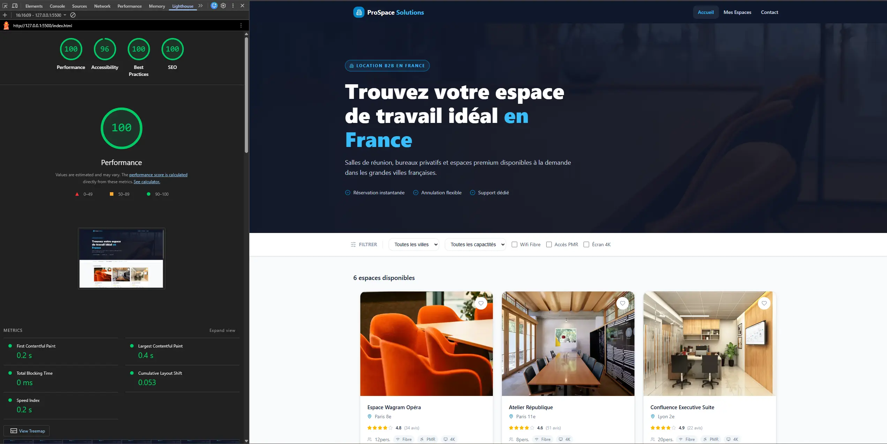
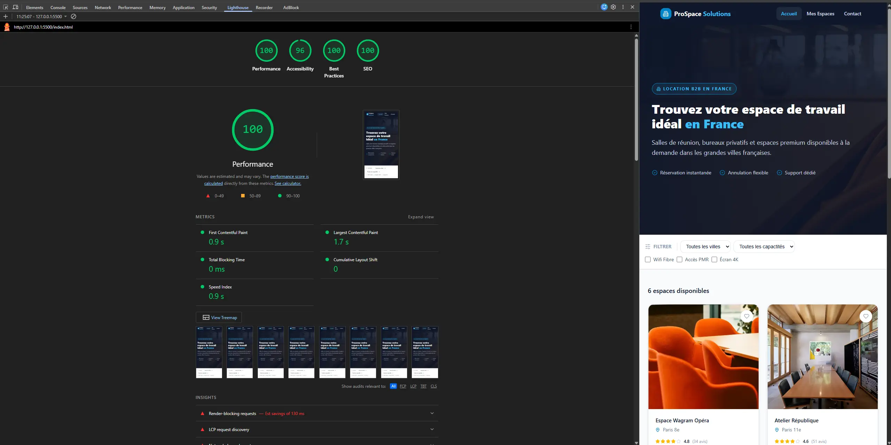
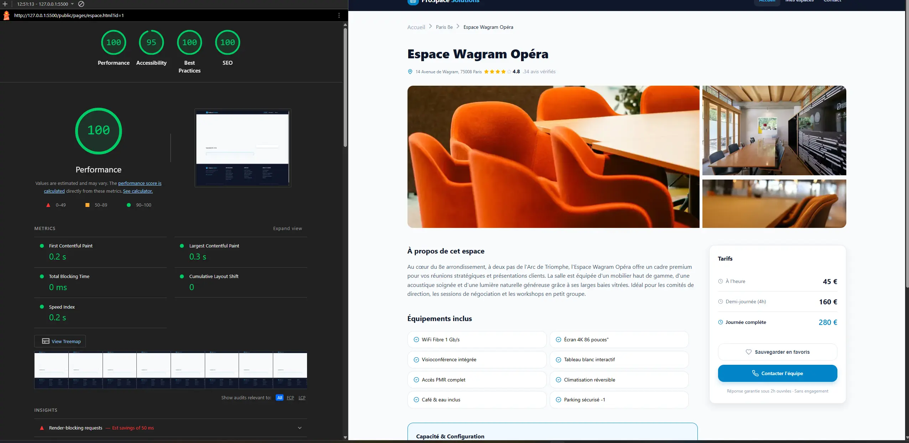
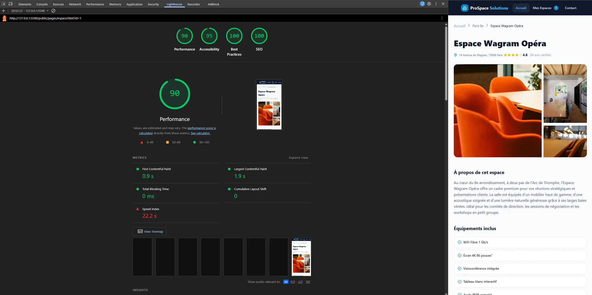
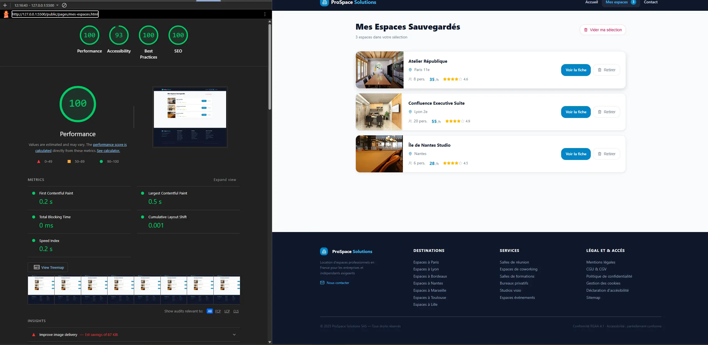
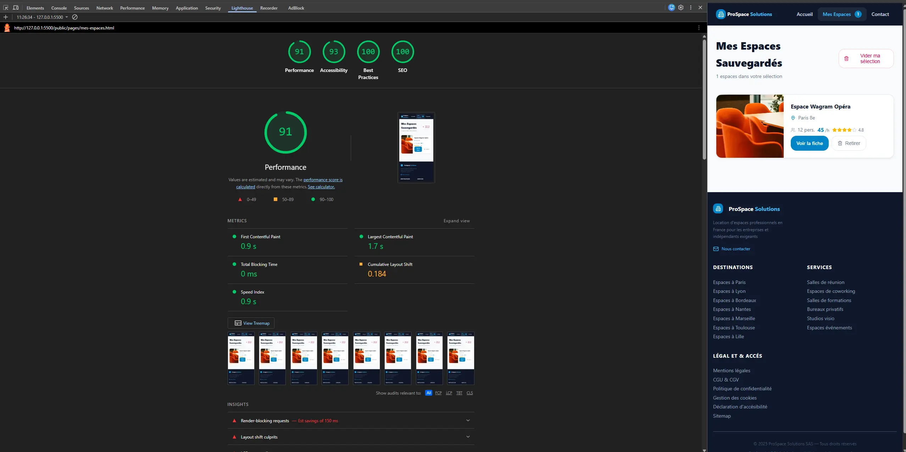
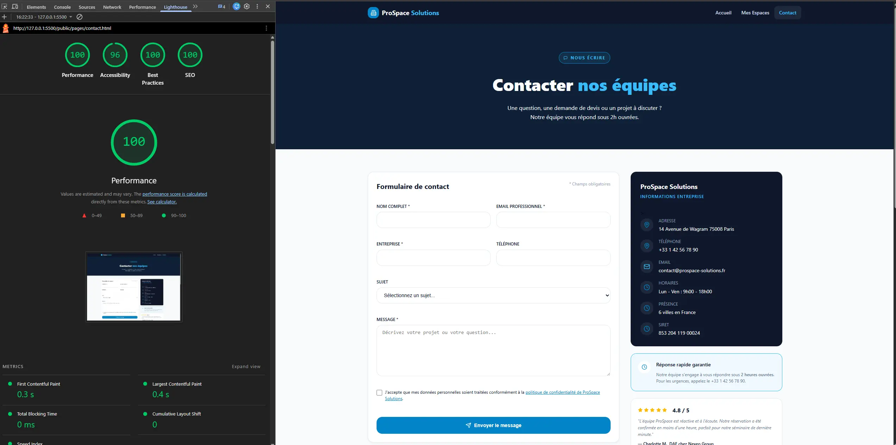
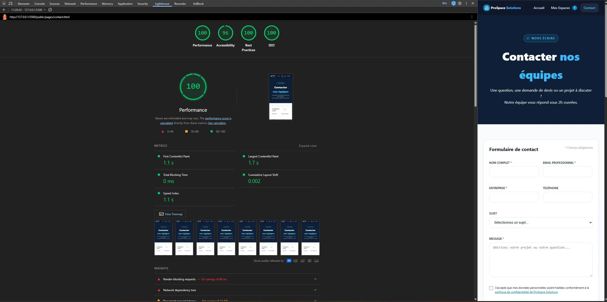

# **ProSpace Solutions**

ProSpace Solutions est un site front-end réalisé dans le cadre de l'examen FRONT END dans ma formation dev web fullstack. Il permet à des professionnels de rechercher des espaces de travail adaptés à leurs besoins.

**Fonctionnalités**
Le site permet notamment de consulter une liste d’espaces disponibles, de filtrer les résultats selon plusieurs critères, d’accéder à une fiche détaillée, d’ajouter ou retirer des espaces des favoris, de consulter les espaces enregistrés et de contacter l’équipe à l’aide d’un formulaire.

**Architecture du projet**

Le dossier public regroupe les fichiers nécessaires au fonctionnement et à l’affichage du site dans le navigateur. Le dossier src contient les fichiers internes au projet, notamment les documents de conception.

-public/assets contient les fichiers SCSS et les images ;
-public/css contient le CSS compilé ;
-public/data contient les données JSON ;
-public/js contient la logique JavaScript ;
-public/fonts contient la typographie installé ;
-public/pages contient les pages HTML secondaires ;
-src/documents contient les documents de conception.
-index.html à la racine pour l'accueil du site

Le fichier main.js contient les fonctions communes au projet.
Les autres fichiers JavaScript sont séparés par page : accueil, fiche espace, favoris et contact.

**Maquettes et documents de conception**

Des schémas de structure ont été réalisés pour représenter l’organisation des différentes pages.

Ils présentent notamment :

-la page d’accueil ;
-la fiche espace ;
-la page Mes espaces ;
-la page Contact ;
-les adaptations tablette et mobile ;
-les parties générées dynamiquement en JavaScript.

Ces documents sont conservés dans le dossier src/documents.

**Gestion des données**

Le projet n’utilise pas d’API distante, mais plusieurs API Web du navigateur, notamment Fetch, URLSearchParams, localStorage et le DOM.

Les données principales du projet sont stockées dans un fichier JSON local.

Chaque espace possède plusieurs informations comme son identifiant, son nom, sa ville, sa capacité, son prix, ses équipements, ses photos sa description ou encore sa meta-description.
Les données sont récupérées en JavaScript avec fetch().
Une fois le fichier chargé, les données JSON sont transformées en objets JavaScript afin de pouvoir être filtrées, recherchées puis affichées dans la page.

**Gestion des paramètres d’URL avec URLSearchParams**

La fiche détaillée utilise un paramètre dans l’URL pour identifier l’espace à afficher.
Par exemple, une fiche peut être appelée avec un identifiant présent après le ? dans l’URL.
URLSearchParams permet de récupérer facilement cette valeur.
L’identifiant récupéré est ensuite converti en nombre, puis utilisé pour rechercher l’espace correspondant dans les données JSON.
Cette méthode permet d’utiliser une seule page HTML pour afficher plusieurs espaces différents.

**Gestion des favoris**

Les favoris sont enregistrés dans le localStorage du navigateur.
Les identifiants des espaces favoris sont enregistrés dans la clé favoris sous la forme d’un tableau converti en chaîne de caractères.
Le localStorage permet de conserver les favoris même après le rechargement ou la fermeture du navigateur.
Comme il stocke uniquement des chaînes de caractères, les tableaux JavaScript sont convertis avant l’enregistrement puis reconstruits lors de leur récupération.
La page mes-espaces utilise ensuite ces identifiants pour retrouver les espaces correspondants dans le fichier JSON.

**SEO**
Chaque page possède un titre et une meta description adaptés à son contenu.
La fiche espace étant dynamique, son titre et sa description sont modifiés en JavaScript selon l’espace affiché.
Cela permet d’avoir des métadonnées différentes tout en utilisant une seule page HTML.
Les images informatives disposent également d’un texte alternatif adapté.
Le projet a été vérifié avec Lighthouse afin de contrôler le SEO.

**Accessibilité**

Une attention particulière a été portée à l'accessibilité.
Les principaux éléments mis en place sont :
-utilisation de balises HTML sémantiques ;
-attributs alt descriptifs sur les images informatives ;
-alt="" pour les images décoratives ;
-aria-label sur certains boutons et liens ;
-aria-describedby pour associer les champs du formulaire aux messages d'erreur ;
-aria-live="polite" pour certaines zones dynamiques ;
-utilisation de vrais boutons HTML pour les interactions ;
-navigation possible au clavier ;
-contrôle de la hiérarchie des titres ;
-validation W3C des pages.

**Score Ligthouse**

Voici les scores demandés par le cahier des charges pour l'accessibilité et le SEO >90

### Page accueil Desktop

### Page accueil Mobile

### Page espace Desktop

### Page espace Mobile

### Page mes-espaces Desktop

### Page mes-espaces Mobile

### Page contact Desktop

### Page contact Mobile

**Installation et lancement du projet**

Après avoir cloné ou téléchargé le projet, il faut lancer le site depuis un serveur local afin que fetch() puisse charger le fichier JSON correctement.
Par exemple avec Live Server dans Visual Studio Code.

**Sass**

L’organisation des fichiers SCSS s’inspire du pattern 7-1 en ne conservant que les dossiers utiles au projet.

Les dossiers SCSS sont séparés selon leur rôle :

-abstracts : variables et mixins ;
-base : styles globaux, reset et typographie ;
-components : boutons, cards, formulaires et carrousel ;
-layout : header et footer ;
-pages : styles propres à chaque page.

Le fichier main.scss importe l'ensemble des fichiers présents dans ces dossiers.
Le SCSS est ensuite compilé dans :public/css/styles.css
Le compilateur Sass est installé localement sur la machine de développement et n’est pas inclus directement dans le projet.
Pour continuer le développement du projet, il faut donc disposer de Sass ou d’un outil équivalent permettant de recompiler les fichiers SCSS après modification.
Pour installer Sass globalement avec npm :
npm install -g sass
et pour compiler :
sass --watch public/assets/main.scss:public/css/styles.css

**Technologies utilisées**

-HTML
-SCSS / CSS
-JavaScript Vanilla
-JSON
-fetch()
-localStorage
-URLSearchParams
-Git
-GitHub

